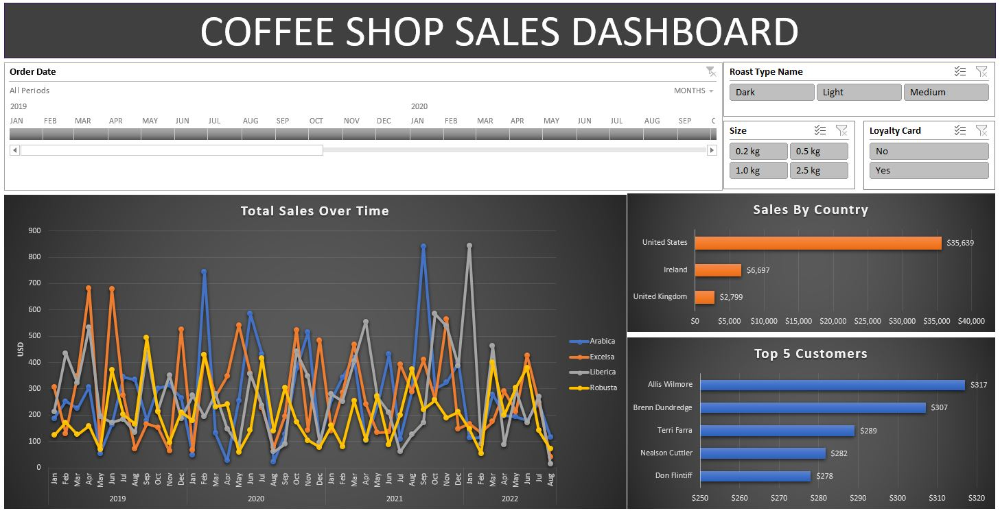

# Coffee-Shop-Sales-Analysis-Dashboard
This project involves analyzing coffee orders data to gain insights into sales, customer demographics, and product performance. 

## Overview
In this project we analyze coffee sales data to gain insights into customers, their orders, and overall product performance. The original dataset consists of sheets providing information on coffee orders, customers and products through which i calculated the total sales metric. A dashboard was built to visualize key performance indicators to help in decision-making for the shop.

## Project Structure

- **Dashboard**: The main visual representation of the data, showing key metrics like total sales, top customers, and product performance.
- **TotalSales**: Insights into total sales over time and across different dimensions.
- **CountryBarChart**: A visual breakdown of sales by country.
- **Top5Customers**: A ranking of the top 5 customers by total purchase value.
- **Orders**: A detailed list of all orders with product and customer information.
- **Customers**: Information about customers including names, contact details, and loyalty card status.
- **Products**: A list of products with details such as price, size, and profit margins.

## Insights from the Dashboard

The following insights were generated from the analysis:

1. **Sales Performance**: The dashboard provides an overview of sales trends, helping to identify peak periods and successful product categories. Total sales values and average order value are displayed, offering a quick snapshot of the business's financial performance.
   
2. **Top Products**: By analyzing the `orders` and `products` sheets, the dashboard identifies the most popular products, including their sales volume and profitability. This helps in understanding which coffee types and product sizes are most favored by customers.

3. **Customer Insights**: The project also focuses on customer behavior, identifying the top 5 customers based on total sales and highlighting regions with high customer activity. The `loyalty card` feature is analyzed to determine its impact on sales and customer retention.

4. **Geographic Distribution**: The `CountryBarChart` visualizes sales performance by country, making it easier to see which regions are driving the most revenue.

5. **Profit Margins**: By examining the `products` sheet, the dashboard highlights the profit margins for each product, assisting in identifying high-margin items for targeted marketing.

